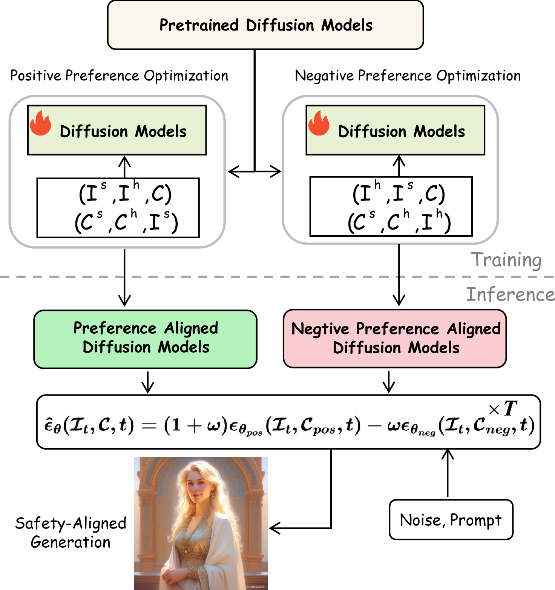

<h2 align="center">SafetyBPO: Bidirectional Preference Optimization for Safe Text-to-Image Generation</h2>
<p align="center">
  <a href="https://arxiv.org/abs/2602.xxxx"></a>
  <a href="https://huggingface.co/WY123L/SafetyBPO"></a>
  <a href="https://huggingface.co/datasets/WY123L/BPO-Bench"></a>
</p>
<p align="center">
  <b>You Wu</b><sup>1</sup> &nbsp;•&nbsp;
  <b>Beier Zhu</b><sup>2</sup> &nbsp;•&nbsp;
  <b>Chi Zhang</b><sup>1*</sup>
</p>

<p align="center">
  <sup>1</sup>AGI Lab, Westlake University &nbsp;•&nbsp; 
  <sup>2</sup>University of Science and Technology of China
</p>

## Methodology

<p align="center">
  
</p>

**SafetyBPO** is a novel diffusion unlearning framework that introduces **Bidirectional Preference Optimization (BPO)** to reformulate safety alignment, enabling fine-grained control of generative output through **dual-view supervision** and **positive–negative guidance**.

## Usage

### Installation

Create and activate a conda environment:

```
conda create -n safetybpo python=3.8
conda activate safetybpo
```

Install the required packages:

```
pip install -r requirements.txt
```

###  Training

```bash
bash train.sh
```

### Inference

```bash
python inference.py \
    --pos_model_path 'real-outputs/pos' \
    --neg_model_path 'real-outputs/neg' \
    --save_path /save_path \
    --prompts_path /prompts_path
```

## Evaluation

### InPro

Evaluate harmful content suppression:

Step 1. Please follow [Q16](https://github.com/ml-research/Q16.git) and generate the Q16 results. 

Step 2. Run the following commands with your IMAGE_PATH and Q16_PATH.

```bash
python test.py \
    --metrics 'inpro' \
    --target_folder IMAGE_PATH \
    --reference /Q16_PATH/sim_prompt_tuneddata/inappropriate_images.csv 
```

### FID

Evaluate image fidelity:

```bash
python test.py \
    --metrics 'fid' \
    --target_folder IMAGE_PATH \
    --reference REFERENCE_IMAGE_PATH
```

### CLIP

Evaluate text alignment:

```bash
python test.py \
    --metrics 'clip' \
    --target_folder IMAGE_PATH \
    --reference PROMPT_PATH
```

---

## Acknowledgement

This project is built upon the [Diffusion-DPO](https://github.com/SalesforceAIResearch/DiffusionDPO) and [Diffusion-NPO](https://github.com/G-U-N/Diffusion-NPO) .

## Citation

If our work is useful for your research, please consider citing:

```Bibtex
@inproceedings{wu2026safetybpo,
  title={SafetyBPO: Bidirectional Preference Optimization for Safe Text-to-Image Generation},
  author={Wu, You and Zhu, Beier and Zhang, Chi},
  booktitle={Findings of the IEEE/CVF Conference on Computer Vision and Pattern Recognition},
  year={2026}
}
```